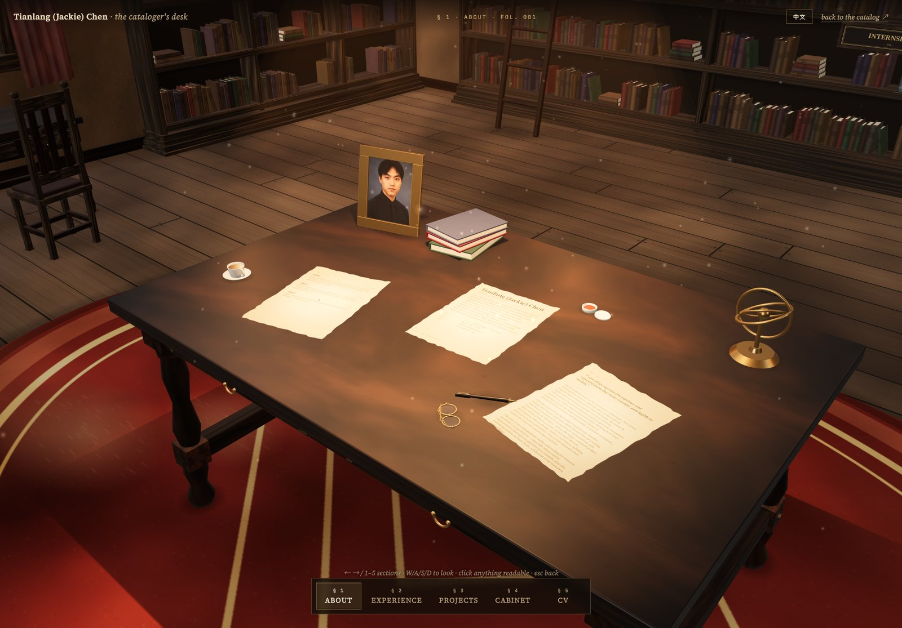
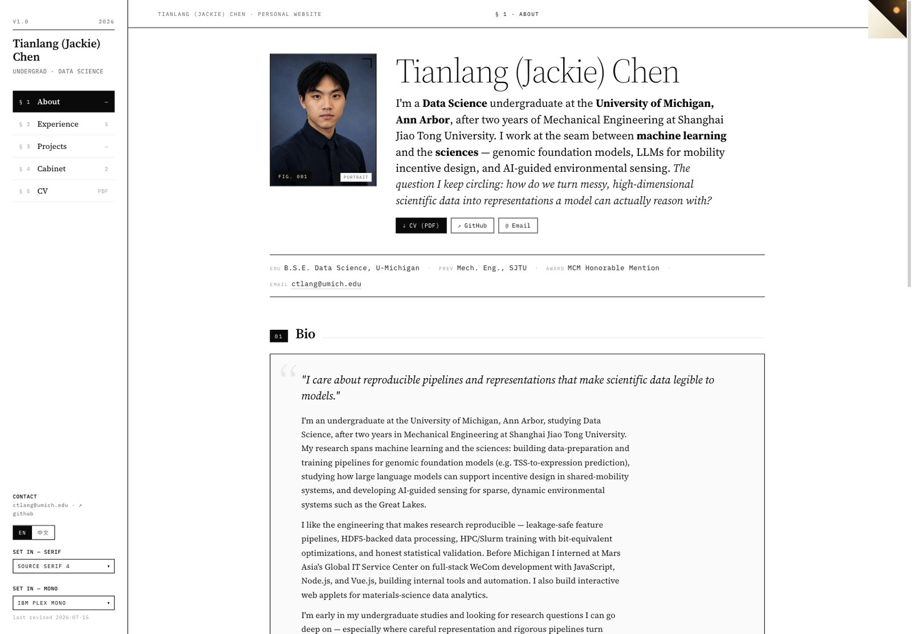

# Tianlang (Jackie) Chen — Personal Website

Personal website of **Tianlang (Jackie) Chen** — a bilingual (EN / 中文)
portfolio rendered two ways: editorial **2D "catalog" pages** and a procedural
**3D "Cataloger's Desk"** WebGL room you can walk around.



## What this is

One static site, two presentations of the same bilingual data:

- **2D** — About / Experience / Projects / Cabinet / CV, in English and Chinese,
  as a clean editorial "catalog".
- **3D** — the same catalog rendered as a Three.js study room: click items to
  read them, walk the walls, and step back through the door to the 2D pages.

Both modes read one shared, fully bilingual data source, so the 3D language
toggle switches instantly with no reload. For how the 2D ⇄ 3D handoff works, see
**[docs/ARCHITECTURE.md](docs/ARCHITECTURE.md)**.



## Run it

```bash
./serve.sh            # serves ./site at http://127.0.0.1:8123
# or:
cd site && python3 -m http.server 8123
```

Then open:

- **2D home:** <http://127.0.0.1:8123/en/>  (中文: `/zh/`)
- **3D room:** <http://127.0.0.1:8123/3d/?lang=en#about>

> Serve it — don't open the `.html` files directly with `file://`. The 3D
> bundle is an ES module and the pages use absolute `/_astro/…` paths, both of
> which need an HTTP origin.

Inside 2D, click the folded page-corner (top-right of the header) to enter the
3D room; inside 3D, *"back to the catalog ↗"* returns you. The `中文 / EN` toggle
in 3D switches language in place.

## What's in `site/`

```
site/
├── en/ … zh/ …        2D pages (home / experience / projects / cabinet / cv × 2 langs)
├── 3d/index.html      the WebGL room (bilingual, toggled client-side)
├── _astro/            build output: the app bundle (Three.js scene), CSS,
│                      router chunks, and responsive .webp image variants
├── cv.pdf             linked CV
├── favicon.jpg  robots.txt
```

The site is self-contained: everything the pages and the 3D scene need at
runtime is served locally. Google Fonts are hotlinked (as designed); nothing
else is fetched from a third party.

## Contact

- GitHub — [@jackiectl](https://github.com/jackiectl)
- Email — <ctlang@umich.edu>

---

<sub>Framework &amp; 3D "Cataloger's Desk" scene originally created by Wang Yuqi (wangyq.me); adapted here as a personal edition.</sub>
